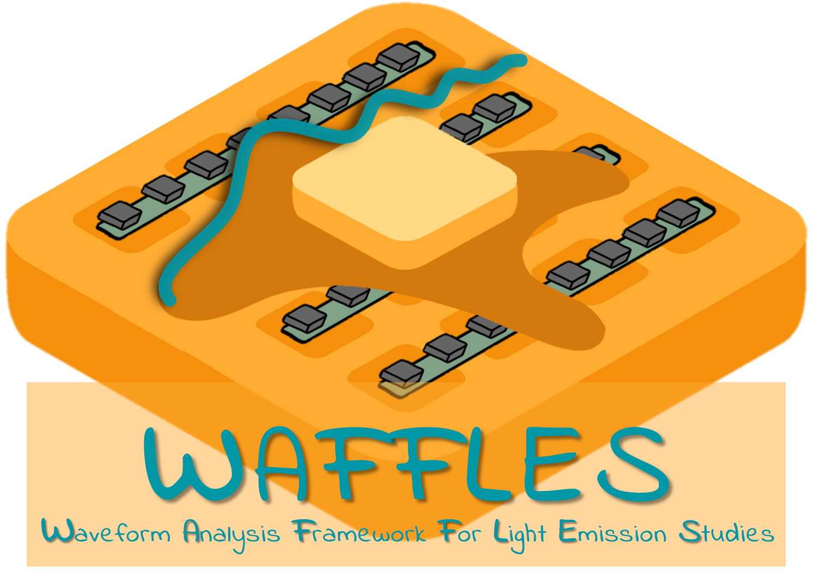

.. waffles documentation master file, created by
   sphinx-quickstart on Mon May 20 16:37:38 2024.
   You can adapt this file completely to your liking, but it should at least
   contain the root `toctree` directive.

.. raw:: html

   

.. role:: tealtitle
.. role:: tealsttle
.. role:: tealstext
.. role:: tealtexts

====================================================
   :tealtitle:`WELCOME TO WAFFLES`
====================================================

.. raw:: html

    

The **Waveform Analysis Framework For Light Emission Studies** (:tealstext:`WAFFLES`) is a Python library used for the PDS analysis in the protoDUNE Horizontal Drift and Vertical Drift (also called NP04 and NP02).  
Waffles can also be used in the future for the DUNE Far Detector modules.

You can navigate through the documentation using the table of contents below, and you can search for specific keywords using the search tab placed at left side.

---------------------------------------------------------------------------------------------------------------------------------------------

**CONTENTS**
============
.. toctree::   
    :maxdepth: 2

    10_Intro  
    20_Scripts  
    30_Libraries
    examples/40_Examples

---------------------------------------------------------------------------------------------------------------------------------------------

.. warning::
    🚧 This project is still under development. Please, contact the authors for more information.🚧

---------------------------------------------------------------------------------------------------------------------------------------------

**CONNECTION TO LXPLUS@CERN.CH ARE NEEDED** -- Check your `CERN account configuration <https://resources.web.cern.ch/resources/>`_.
To access lxplus run ``ssh yourusername@lxplus.cern.ch``

**QUICK START**
================

-----------------------------------------------------------------------------------
0.- Install (first time) or source (every time you log-in) your virtual environment 
-----------------------------------------------------------------------------------

* If you need to decode ``.hdf5`` files you need to install the ``dbt`` environment. This environment is needed to extract PDS data from the raw DAQ data.

  To install the environment check for the last version and run:

  .. code-block:: bash
  
     source /cvmfs/dunedaq.opensciencegrid.org/setup_dunedaq.sh  # Source the dunedaq environment
  
     setup_dbt latest                                            # Setup the latest version of dbt
     dbt-create -l                                               # List the available versions of dbt
     dbt-create <latest_dbt_version>                             # Create a new dbt environment with the version fddaq-v*
     source <my_daq_dir>/env.sh                                  # Source the dbt environment

* If you just want to analyze the already generated processed files this requirement becomes optional and you can create a python virtual environment with:

  .. code-block:: bash
  
     python3 -m venv /path/to/new/virtual/environment      # Create a new virtual environment
     source /path/to/new/virtual/environment/bin/activate  # Activate the environment
  
    
  If you want to have access to the ``ROOT`` library you need to have it sourced in your environment. Add these lines at the end of the ``bin/activate`` file:

  .. code-block:: bash
  
     source /cvmfs/sft.cern.ch/lcg/app/releases/ROOT/6.32.02/x86_64-almalinux9.4-gcc114-opt/bin/thisroot.sh
     export JUPYTER_CONFIG_DIR=$VIRTUAL_ENV

.. admonition:: **WARNING** 
   ROOT will not be supported anymore. Gradually move to only ``hdf5`` files.

-------------------------
1.- Clone the repository
-------------------------

It is better to create the waffles repository inside the daq folder created at the step 0 (see above).
Ensure your SSH keys are properly set up.

To clone the repository:

.. code-block:: bash

   git clone git@github.com:DUNE/waffles.git

and to create your own branch:

.. code-block:: bash
   cd waffles
   git checkout -b <your_branch_name>

If you want to have a personal folder to store your test files locally you can create a ``test`` folder (it won't be synchronized with the repository).
Otherwise, you can create a folder for your custom scripts and add them to the ``.gitignore`` file:

.. code-block:: bash

   mkdir <your_folder_name>
   echo "<your_folder_name/*>" >> .gitignore

----------------------------------------------------
2.- Install packages needed for the library to run
----------------------------------------------------

Once you have your environment sourced (``source env.sh``) you can install the packages needed for the library with:

.. code-block:: bash

   cd /path/to/waffles # Go to the waffles main folder
   which python3 # Should show the .venv Python
   python3 -m pip install -r requirements.txt . # Install the requirements for the library

----------------------
3.- Access the data  
----------------------

Part of the PDS data is stored in the ``eos`` CERN storage system. 

Useful paths for NP02:
* **RAW ROOT FILES**: ``/eos/experiment/neutplatform/protodune/experiments/ProtoDUNE-VD/commissioning/raw/``
* **WAFFLES PROCESSED FILES**: ``/eos/experiment/neutplatform/protodune/experiments/ProtoDUNE-VD/commissioning/processed/``
* **RUCIO PATHS**: ``/eos/experiment/neutplatform/protodune/experiments/ProtoDUNE-VD/ruciopaths/``

Useful paths for NP04:
* **TUTORIAL INFO**: ``/eos/experiment/neutplatform/protodune/experiments/ProtoDUNE-II/PDS_Commissioning/waffles/0_TUTORIAL`` 
* **RUCIO PATHS**: ``/eos/experiment/neutplatform/protodune/experiments/ProtoDUNE-II/PDS_Commissioning/waffles/1_rucio_paths`` 
* **RAW ROOT FILES**: ``/eos/experiment/neutplatform/protodune/experiments/ProtoDUNE-II/PDS_Commissioning/waffles/2_daq_root``

If the run is not already in there, you should create a .txt file, with the corresponding rucio path. 

Have a look at the examples tab for more information on how to run waffles.

Depending on the scope of your analysis you may need a different machine:
   
* **OFFLINE** analysis: log-in to lxplus with your CERN user: ``ssh CERNuser@lxplus.cern.ch``
* **ONLINE** + **DATA TAKING**: log-in to np04-srv-004 with your CERN user: ``ssh CERNuser@np04-srv-004.cern.ch``. This can also be accessed inside lxplus.

---------------------------------------------------------------------------------------------------------------------------------------------

**INDICES AND TABLES**
======================

* :ref:`genindex`
* :ref:`modindex`
* :ref:`search`